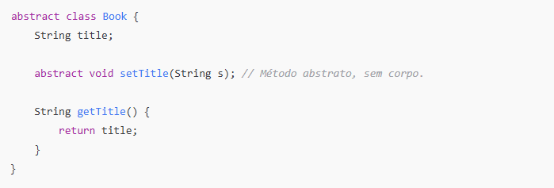

# Desafio de código e uma breve explicação sobre classe abstrata

Uma classe abstrata não pode ser instanciada diretamente, ou seja, você não pode criar objetos a partir dela. Ela serve como uma base para que outras classes herdem suas propriedades e métodos.

## Exemplo de classe abstrata:

### O que está acontecendo:
- O método setTitle é abstrato, ou seja, ele não tem implementação na classe abstrata Book. Isso obriga qualquer classe que herde Book a implementar o método setTitle.
- A classe Book também tem um método concreto (getTitle) que retorna o valor de title.

